# Research: Cascade Re-Run 5xj + m07 Failure Surfaces

**Date**: 2026-04-27T09:56:49-04:00
**Researcher**: Silmari (via Opus 4.7)
**Git Commit**: `437b9201`
**Branch**: `main`
**Repository**: tha-hammer/silmari-agent-memory

```
┌────────────────────────────────────────────────────────────────────┐
│  CASCADE RE-RUN POST-MORTEM — TWO RESIDUAL FAILURE SURFACES        │
│  Run: 2026-04-26 15-transcript ingest (3/15 ingested, 145 cards)   │
│  bd 5xj — zk_save_cards exceeds 60s MCP client timeout             │
│  bd m07 — folgezettel cursor drift past actually-saved cards       │
└────────────────────────────────────────────────────────────────────┘
```

## 🎯 Research Question

Document the codebase surfaces relevant to two new P1 bds surfaced by the 2026-04-26 operational re-run:

1. **5xj** — `zk_save_cards` (the new batch primitive from commit 5946a68) exceeds the 60s MCP client default timeout on transcripts 4 + 5.
2. **m07** — folgezettel cursor advances past actually-saved cards when transcripts 4 + 5 time out mid-save, producing 10 successive `no parent card exists at 1/<N>` failures on transcripts 6–15.

Specific surfaces requested: GATE_B_MCP_TIMEOUT_MS plumbing, MCP SDK default timeout, the four `zk_save_cards` callTool sites, cursor write ordering vs brCreateBatch, transactional boundaries, reconciliation primitives, transcript-boundary hooks, and prior-bd lineage.

---

## 📋 Summary

| Finding | Status |
|---|---|
| MCP SDK `DEFAULT_REQUEST_TIMEOUT_MSEC` is 60000ms (60s) | ✅ Verified |
| `GATE_B_MCP_TIMEOUT_MS` (180s default) is wired ONLY to `zk_propose_links_semantic` | ✅ Verified |
| The four `zk_save_cards` callTool sites pass NO timeout opts → fall back to 60s SDK default | ✅ Verified |
| `assignFolgezettel` writes the cursor file IMMEDIATELY (before brCreate) | ✅ Verified |
| `saveCardsBatch` advances the cursor N times in pre-pass BEFORE the single `brCreateBatch` shell-out | ✅ Verified |
| `brCreateBatch` failure does NOT roll back any cursor advances | ✅ Verified |
| No "reconcile cursor from store" primitive exists anywhere in the codebase | ✅ Verified |
| The transcript-boundary hook in cascade `main()` does ONLY a WAL checkpoint — no cursor reset | ✅ Verified |
| The MCP client connection persists across all 15 transcripts (single `client.connect()` at startup) | ✅ Verified |
| Only ONE existing test asserts cursor immutability on failed save (zk-save-card-fromaddress.test.ts:200, single-card path only) | ✅ Verified |

**Plain-language summary**: For 5xj, the user's hypothesis is fully confirmed by the code — `GATE_B_MCP_TIMEOUT_MS` is a per-call opts override threaded through a callTool wrapper added by 33a1110, and the new `zk_save_cards` call sites simply don't pass it. For m07, the cursor-drift mechanism is structural: every `assignFolgezettel` call writes the cursor file synchronously, `saveCardsBatch` calls it N times in a pre-pass loop, and the subsequent `brCreateBatch` has no rollback path. There is no reconciliation tooling and no per-transcript cursor reset.

---

## 🗺️ Systems Map

### Topology — process boundaries + persistent state

```mermaid
flowchart LR
    subgraph CascadeProc["Cascade process (host or docker container)"]
        Loop["main() for-loop<br/>ingest-cascade.ts:691-768<br/>iterates 15 transcripts"]
        STree["saveCardTree<br/>4 zk_save_cards calls/transcript<br/>lines 357 / 385 / 419 / 452"]
        GateB["runGateBForCard<br/>1× zk_propose_links_semantic per card<br/>line 518-528"]
        CallTool["callTool wrapper<br/>line 277-300<br/>opts.timeout passthrough"]
        Client["MCP Client<br/>SDK default timeout: 60s"]
    end

    subgraph SilmariProc["silmari-mcp child process (long-lived; persists across all 15 transcripts)"]
        Dispatch["dispatchTool switch<br/>index.ts:498-844"]
        SCB["saveCardsBatch<br/>card-ops.ts:901-1042"]
        RPS["runPostSaveSteps<br/>card-ops.ts:524-645<br/>per-card subprocesses"]
        AssignFZ["assignFolgezettel<br/>folgezettel.ts:268-307"]
    end

    subgraph FS["Persistent state (filesystem)"]
        Cursor[("folgezettel-cursors.json<br/>SILMARI_IDEA_DIR<br/>NO transactional binding to br")]
        Beads[("beads.db + WAL<br/>SILMARI_IDEA_DIR/.beads/<br/>truncate-checkpointed between transcripts")]
    end

    subgraph BRProc["br subprocesses (per-call)"]
        BRC["br create -f tmpfile.md --json<br/>brCreateBatch<br/>br-adapter.ts:175-225"]
        BRL["br list / br show / br label add<br/>per-card during pre/post-pass"]
    end

    Loop -->|per transcript| STree
    Loop -->|per saved card| GateB
    STree --> CallTool
    GateB --> CallTool
    CallTool --> Client
    Client -.->|stdio JSON-RPC| Dispatch
    Dispatch --> SCB
    SCB -->|N times in pre-pass| AssignFZ
    SCB -->|once after pre-pass| BRC
    SCB -->|N times in post-pass| RPS
    RPS --> BRL
    AssignFZ -->|writeCursors| Cursor
    BRC -->|writes| Beads
    BRL -->|reads / writes| Beads

    classDef failure5xj stroke:#d33,stroke-width:3px,fill:#ffe5e5
    classDef failurem07 stroke:#d80,stroke-width:3px,fill:#fff3d6
    class CallTool,Client failure5xj
    class AssignFZ,Cursor failurem07
```



**Legend**:
- 🟥 red border = bd 5xj surfaces — MCP timeout boundary (CallTool wrapper + Client SDK default)
- 🟧 orange border = bd m07 surfaces — cursor write path (assignFolgezettel + folgezettel-cursors.json)

### Failure sequence — one transcript through saveCardTree

```mermaid
sequenceDiagram
    autonumber
    participant Loop as cascade for-loop<br/>(per transcript)
    participant Client as MCP Client<br/>(60s SDK default)
    participant Server as silmari-mcp<br/>(server-side)
    participant Batch as saveCardsBatch
    participant FZ as folgezettel-cursors.json
    participant BR as br create -f<br/>(subprocess)

    Loop->>Client: callTool("zk_save_cards", {cards: [thesis,...]})
    Note right of Client: ❌ 5xj — no opts.timeout passed,<br/>falls back to 60s SDK default
    Client->>Server: JSON-RPC over stdio
    Server->>Batch: dispatchTool

    rect rgb(255,235,235)
    Note over Batch,FZ: PRE-PASS — per card × N (lines 922-989)
    Batch->>FZ: assignFolgezettel → writeCursors (line 305)
    Note right of FZ: ❌ m07 — cursor file written<br/>BEFORE any brCreate
    Batch->>FZ: ... × N
    end

    rect rgb(255,250,230)
    Note over Batch,BR: PHASE 2 — single shell-out (line 1001)
    Batch->>BR: br create -f tmpfile.md --json<br/>(timeout = 1000ms × N)

    alt brCreateBatch throws (subprocess timeout, malformed md)
        BR--xBatch: error
        Note over Batch,FZ: ❌ m07 — cursor advanced N steps,<br/>0 cards in br, NO ROLLBACK
        Batch--xServer: throw propagates
    else brCreateBatch returns ids
        BR-->>Batch: [{id,...},...] in input order
    end
    end

    rect rgb(235,250,235)
    Note over Batch: POST-PASS — runPostSaveSteps × N<br/>sweep + Tier A + reinforces + L2 + L4<br/>(per-card subprocesses survive batch)
    end

    Batch-->>Server: SaveCardResult[]
    Server-->>Client: JSON-RPC response

    alt Cascade 60s timer fired before response
        Note over Client,Loop: ❌ 5xj — Client already rejected the promise<br/>Server work continues invisibly
        Client--xLoop: MCP error -32001 (timed out)
        Note over Loop: catch at ingest-cascade.ts:736<br/>writes failure-report.json<br/>moves to next transcript
        Note over FZ: ❌ m07 — cursor reflects work<br/>the cascade never observed
    else Within 60s
        Client-->>Loop: SaveResult[]
        Loop->>Loop: continues to next tier
    end

    Note over Loop: Between transcripts:<br/>checkpointWal(beads.db) ONLY<br/>(ingest-cascade.ts:758-767)<br/>⚠️ NO cursor reconciliation
```

### Cursor state evolution — what each transcript inherits

```mermaid
flowchart TB
    T1["Transcript 1<br/>cursor before: empty<br/>thesis saves at 1/1<br/>themes/ideas/micros land<br/>cursor after: ~1/2c5"] --> CK1{"checkpointWal<br/>(no cursor reset)"}
    CK1 --> T2["Transcript 2<br/>cursor before: 1/2c5<br/>thesis saves at 1/2<br/>...lands cleanly<br/>cursor after: ~1/3a4"]
    T2 --> CK2{"checkpointWal"}
    CK2 --> T3["Transcript 3<br/>...lands cleanly<br/>cursor after: ~1/4b2"]
    T3 --> CK3{"checkpointWal"}
    CK3 --> T4["Transcript 4<br/>cursor before: 1/4b2<br/>thesis saves at 1/5<br/>SOMETHING TIMES OUT mid-save<br/>cursor after: 1/5...somewhere advanced<br/>br state: ambiguous"]
    T4 --> CK4{"checkpointWal"}
    CK4 --> T5["Transcript 5<br/>same fate as T4<br/>cursor after: 1/6...further advanced"]
    T5 --> CK5{"checkpointWal"}
    CK5 --> T6["Transcript 6<br/>thesis at 1/7 (cursor said so)<br/>theme[0] forks from 1/7<br/>resolveExplicitTarget brList<br/>+ 100ms WAL retry<br/>NOT FOUND<br/>❌ throws (6jp hard-fail)"]
    T6 --> CK6{"checkpointWal"}
    CK6 --> T715["Transcripts 7-15<br/>same shape as T6<br/>each fails on its tier-2 fork<br/>each advances cursor by ~1 (thesis only)"]

    classDef ok fill:#dfd,stroke:#393
    classDef bad fill:#fdd,stroke:#933
    class T1,T2,T3 ok
    class T4,T5,T6,T715 bad
```



> **Note**: This timeline is the user's bd-described reconstruction. Empirical confirmation (which slot each transcript landed at, what's actually in br) requires post-run inspection of `silmari-kc-baker_store/box2-ideas/.beads/` and the failure-report.json files — see Open Question 2.

---

## 🔍 Detailed Findings

### Surface A — bd 5xj: MCP timeout architecture

#### A1. SDK default timeout

📍 **Verified location**: `apps/silmari-mcp/node_modules/@modelcontextprotocol/sdk/dist/esm/shared/protocol.js:8`

```js
export const DEFAULT_REQUEST_TIMEOUT_MSEC = 60000;
```

Used at `protocol.js:712`:
```js
const timeout = options?.timeout ?? DEFAULT_REQUEST_TIMEOUT_MSEC;
```

The `options.timeout` is the third positional argument to `client.callTool(request, schema?, {timeout})`. Type declaration mirrors at `apps/silmari-mcp/node_modules/@modelcontextprotocol/sdk/dist/esm/shared/protocol.d.ts:75`:
> *"If not specified, `DEFAULT_REQUEST_TIMEOUT_MSEC` will be used as the timeout."*

#### A2. GATE_B_MCP_TIMEOUT_MS plumbing (commit 33a1110)

📍 **Constant declared**: `scripts/kc-baker-pipeline-v2/ingest/ingest-cascade.ts:199-201`

```ts
const GATE_B_MCP_TIMEOUT_MS = Number(
  process.env.GATE_B_MCP_TIMEOUT_MS ?? "180000",
);
```

📍 **callTool wrapper signature** (third arg added by 33a1110): `scripts/kc-baker-pipeline-v2/ingest/ingest-cascade.ts:277-300`

```ts
async function callTool<T>(
  client: Client,
  name: string,
  args: Record<string, unknown>,
  opts?: { timeout?: number },
): Promise<T> {
  const res = (await client.callTool(
    { name, arguments: args },
    undefined,
    opts?.timeout ? { timeout: opts.timeout } : undefined,
  )) as { ... };
```

📍 **Sole consumer**: `scripts/kc-baker-pipeline-v2/ingest/ingest-cascade.ts:518-528` — `runGateBForCard` passes `{ timeout: GATE_B_MCP_TIMEOUT_MS }` to `zk_propose_links_semantic`.

**Verbatim from 33a1110 commit message**:
> "Other MCP calls stay on the SDK default (save, hub_members, line_of_thought land in <5s each)."

That assumption was correct for the pre-rkl single-card `zk_save_card`. With `zk_save_cards` (batch tool added by 5946a68) the per-call work scales with the batch size N — see A4 below.

#### A3. The four `zk_save_cards` callTool sites

All four sites in `scripts/kc-baker-pipeline-v2/ingest/ingest-cascade.ts` (added by commit 5946a68 in `saveCardTree`):

| Tier | Line | Cards (typical) | Passes timeout opts? |
|---|---|---|---|
| 1. Thesis | `357-365` | 1 | ❌ No |
| 2. Themes | `383-385` | 3-8 | ❌ No |
| 3. Ideas | `417-421` | 20-50 | ❌ No |
| 4. Micros | `450-454` | 100-300+ | ❌ No |

All four invocations use the form `await callTool<SaveResult[]>(client, "zk_save_cards", { cards: [...] })` — no `opts` argument. The Tier 4 micros call is the highest-risk single MCP round-trip in the entire cascade.

#### A4. Realistic upper-bound work per `zk_save_cards` call

Server-side, `saveCardsBatch` (`apps/silmari-mcp/src/lib/card-ops.ts:901-1042`) does:

**Pre-pass** (`922-989`, per card × N):
- `hashBody` + `shortHash` (cheap CPU)
- `resolveExplicitTarget` (`934`) — for every fork/continue card, calls `brList` (subprocess) + 100ms WAL retry on miss (folgezettel.ts:686-694) → **per-card subprocess cost survives the batch**
- `findByContentHash` (`938`) — another `brList` subprocess
- `assignFolgezettel` (`953`) — writes cursor JSON file synchronously
- Label/description composition (cheap CPU)

**Single shell-out** (`1001`):
- `brCreateBatch` — one `br create -f tmpfile.md --json` subprocess. Timeout scales with batch size: `TIMEOUT_WRITE * N` = `1000 * N` ms. For N=200 micros → 200s subprocess budget.

**Post-pass** (`1010-1039`, per card × N) via `runPostSaveSteps` (`apps/silmari-mcp/src/lib/card-ops.ts:524-645`):
- `sweepDuplicates` (`526` → card-ops.ts:423 brList subprocess)
- Tier A: `lineOfThought` (`558` — multiple `brShow` subprocesses) + `runExtractors` + N × `addEdge` (each a `brLabelAdd` subprocess)
- r04 reinforces emit (`600-605`): `addEdge` + 2 × `brLabelAdd` per card with body-hash match
- L2 keyword writes (`609-633`): `extractTerms` + N × `addKeywordEntry` (sqlite write)
- L4 anchor check (`636-642`): JSON log line

**Per-card subprocess count surviving the batch**: ~4-8 (resolveExplicitTarget brList + retry, findByContentHash brList, sweepDuplicates brList, lineOfThought brShows, addEdge brLabelAdds). The `brCreateBatch` collapse is one component of total work; the per-card subprocess cost in pre-pass + post-pass remains per-card.

For a 200-micro tier4 batch, even at a generous 50ms per subprocess, 200 × 6 subprocesses = 60+ seconds of pre/post-pass subprocess work alone, BEFORE the brCreateBatch shell-out. The 60s MCP client timeout is plausibly exceeded by the pre/post-pass alone on large transcripts.

#### A5. Per-tool-call timeout overrides on the silmari-mcp server side

📍 **Server-side dispatcher**: `apps/silmari-mcp/src/index.ts:498-844`

The silmari-mcp server has NO per-tool execution time limit, no pre-emptive abort, no progress streaming. It runs `dispatchTool(name, args)` to completion and then returns the result. The cascade-side 60s MCP timeout fires on the CLIENT — but the SERVER continues executing until natural completion. This means:

- After a client-side timeout: the silmari-mcp child process keeps running the batch
- It still writes cards to `br` (via `brCreateBatch`)
- It still completes per-card post-pass work
- It returns its (now-orphaned) response to a closed channel
- Cascade caller never sees the result

There is no observable mechanism in the codebase (search complete) by which the silmari-mcp server learns that the client gave up on the request.

---

### Surface B — bd m07: Cursor drift architecture

#### B1. Cursor file write timing

📍 **Cursor file path**: `${SILMARI_IDEA_DIR}/folgezettel-cursors.json` — computed at `apps/silmari-mcp/src/lib/folgezettel.ts:189-191`

📍 **Write site**: `apps/silmari-mcp/src/lib/folgezettel.ts:238-241` — `writeCursors` does an atomic `writeAtomic(...)` of the JSON file. No transaction, no rollback hook.

📍 **assignFolgezettel** (`apps/silmari-mcp/src/lib/folgezettel.ts:268-307`):

```ts
export function assignFolgezettel(
  trunk: TrunkId,
  mode: FolgezettelMode,
  fromSequence?: string,
): string {
  // ... validation ...
  const file = readCursors();
  // ... compute next sequence ...
  file.cursors[key] = next;
  writeCursors(file);              // ← cursor written IMMEDIATELY (line 305)
  return next;
}
```

The cursor write happens BEFORE the function returns. There is no "deferred write" or "pending advance" state.

#### B2. saveCardsBatch's pre-pass cursor sequence

📍 **The for-loop** at `apps/silmari-mcp/src/lib/card-ops.ts:922-989`:

```ts
for (const o of opts) {
  // ...
  const explicitTarget = resolveExplicitTarget(...);   // (line 934) throws on miss
  // ...
  try {
    // ...
    const sequence = assignFolgezettel(o.trunk, effectiveMode, ...);   // (line 953) WRITES CURSOR
    fzAddress = formatAddress(o.trunk, sequence);
    // ...
  } catch (err) {
    if (explicitTarget) throw err;
    console.error(`⚠️ saveCardsBatch: folgezettel assignment failed for trunk ${o.trunk}: ...`);
  }
  // ... compose labels ...
  prepped.push({ ... });
}
// AFTER all N cards are pre-prepped:
const createdIds = brCreateBatch({ box, markdown: md, count: prepped.length });   // (line 1001)
```

**Critical ordering**: All N `assignFolgezettel` calls (and therefore N cursor file writes) complete BEFORE `brCreateBatch` is invoked. If `brCreateBatch` throws (subprocess timeout, malformed markdown, etc.), the cursor has already moved N steps and zero cards are in `br`.

#### B3. Transactional boundary on brCreateBatch failure

📍 **brCreateBatch** at `apps/silmari-mcp/src/lib/br-adapter.ts:175-225`:

```ts
export function brCreateBatch(opts: BrCreateBatchOpts): string[] {
  if (!ensureBoxWorkspace(opts.box)) {
    throw new Error(`brCreateBatch: cannot ensure box workspace ${opts.box}`);
  }
  _brCreateBatchInvocationCount++;
  const tmpFile = ...;
  writeFileSync(tmpFile, opts.markdown, 'utf-8');
  try {
    const args = ['create', '-f', tmpFile, ...baseFlags(opts.box)];
    const out = execFileSync(BR, args, { ... });
    const parsed = JSON.parse(out);
    if (!Array.isArray(parsed)) {
      throw new Error(`brCreateBatch: expected JSON array ...`);
    }
    return parsed.map((issue: any) => String(issue.id));
  } finally {
    try { unlinkSync(tmpFile); } catch { /* best-effort cleanup */ }
  }
}
```

The only `try/finally` here protects the temp-file cleanup. There is **no try/catch around the cursor advance** in `saveCardsBatch`, and **no rollback** call to revert `writeCursors`.

📍 **Caller-side** (`apps/silmari-mcp/src/lib/card-ops.ts:1001`): the `brCreateBatch` invocation is bare — its throw propagates straight through `saveCardsBatch`'s caller and out to the MCP `dispatchTool` (`apps/silmari-mcp/src/index.ts:524-541`), which converts it into an `isError: true` MCP response.

📍 **MCP transport failure (client-side timeout)**: When the cascade-side 60s timer fires, the `client.callTool(...)` promise rejects. The silmari-mcp server side has no signal — it continues to completion. The cursor advances reflect work the server is still doing. The CLIENT throws and the cascade catches it at the per-transcript try/catch (`scripts/kc-baker-pipeline-v2/ingest/ingest-cascade.ts:736-750`).

#### B4. Reconciliation primitives — none exist

🚫 **No reconcile-from-store primitive exists anywhere in the codebase.** Verified by parallel sub-agent search across `apps/silmari-mcp/src/`, `apps/silmari-mcp/scripts/`, top-level `scripts/`, `deploy/`, `vendor/beads_rust/`.

📍 **Documented intent that was never implemented**:
- `Plans/001_zettelkasten-agent-memory-mcp.md:324`: *"Migration path for existing vultr01 cursors: ignored — Silmari imports the beads themselves, not the cursor file, and rebuilds cursors from the max address per trunk on first run."*
- `apps/silmari-mcp/src/lib/folgezettel.ts:205-215` (in `readCursors` docstring): *"Wrong schema version (returns empty, warns on stderr — rebuild from max addresses is the caller's responsibility; see Plans/001 §3.2b)."*

The intent was: when the cursor file is missing/corrupt/wrong-schema, scan all `fz:<trunk>_<seq>` labels in the box to reconstruct the cursor. The actual implementation (`folgezettel.ts:208-231` `readCursors`) returns `emptyCursorFile()` on any failure mode — it does not scan `br`.

📍 **Reconciliation that DOES exist (different domain)**: `apps/silmari-mcp/scripts/reconcile-keyword-index.ts:1-199` — scans the `keyword_entries` table for phantom pointers to deleted cards. Not related to folgezettel.

#### B5. Transcript-boundary hook (cascade-side)

📍 **The for-loop** at `scripts/kc-baker-pipeline-v2/ingest/ingest-cascade.ts:691-768`:

```ts
for (const basename of basenames) {
  // ... per-transcript work ...
  try {
    const report = await ingestCascadeOne(client, { basename, ... });
    // success path: write ingest-report.json, clear stale failure-report.json
  } catch (e) {
    console.error(`[ingest] ${basename} — FAILED: ${(e as Error).message}`);
    // failure path: write failure-report.json
    failed += 1;
  }
  // bd silmari-agent-memory-rkl mitigation: TRUNCATE-checkpoint the
  // beads_rust WAL between transcripts.
  const ck = checkpointWal(beadsDbPath);
  if (ck) { /* log ... */ }
}
```

**Between-transcript work consists of EXACTLY ONE side effect**: a `PRAGMA wal_checkpoint(TRUNCATE)` on `${SILMARI_DIR}/box2-ideas/.beads/beads.db` (`checkpointWal` at `scripts/kc-baker-pipeline-v2/ingest/ingest-cascade.ts:153-182`). There is no cursor reset, no client reconnect, no silmari-mcp restart, no max-fz scan.

#### B6. MCP client lifecycle across the 15-transcript loop

📍 **Single client connection** at `scripts/kc-baker-pipeline-v2/ingest/ingest-cascade.ts:649-658`:

```ts
const transport = new StdioClientTransport({
  command: "bun",
  args: ["run", mcpEntry],
  env: { ...process.env } as Record<string, string>,
});
const client = new Client(...);
await client.connect(transport);
```

📍 **Single client close** at line `771` (in `finally` after the entire 15-transcript loop completes).

The same MCP client (and therefore the same silmari-mcp child process) services all 15 transcripts. State that lives on the silmari-mcp server side (e.g., the `_brCreateBatchInvocationCount` test counter, any in-process module-level caches like `_brAvailable` at `apps/silmari-mcp/src/lib/br-adapter.ts:48`) persists across the entire run. The cursor itself is FILE-based, so server restart wouldn't change the drift behavior.

#### B7. Test coverage gaps

📍 **Existing cursor-related tests**:

| File | Cursor coverage | Asserts cursor-after-failure? |
|---|---|---|
| `apps/silmari-mcp/tests/folgezettel.test.ts` | 18 tests on `assignFolgezettel`, `readCursors` robustness, disk persistence | Partial — `readCursors` handles corrupt/missing files; no failure-rollback tests |
| `apps/silmari-mcp/tests/zk-save-card-fromaddress.test.ts` | bd 6jp tests at line 200-212 ("failed fork does NOT consume a trunk-root slot"), line 214 ("successful save still advances cursor") | ✅ Yes — but ONLY for single-card `zk_save_card` path |
| `apps/silmari-mcp/tests/zk-save-cards-batch.test.ts` | B4 schema, B5 single-subprocess, B6 ordered, B7 empty input, B8 reinforces, B9 parity | ❌ NO — no test asserts cursor state after `brCreateBatch` throws |
| `scripts/kc-baker-pipeline-v2/tests/ingest-cascade.test.ts` | Pure-helper tests only (groupMicros, saveArgsForSibling, etc.) | ❌ NO multi-transcript loop coverage |

**Missing coverage shapes**:
- No test exercises "FIRST batch fails → SECOND batch starts from a clean cursor"
- No test simulates a `brCreateBatch` mid-call failure (subprocess timeout, malformed markdown)
- No test exercises the cascade `main()` multi-transcript loop where transcript-N cursor drift affects transcript-N+1

---

### Surface C — Bug lineage (cursor-touching commits)

#### C1. bd timeline from `bd show` + `git log`

| bd | Status | Mentions cursor drift? | What it actually fixed |
|---|---|---|---|
| **silmari-agent-memory-7qr** | OPEN | YES | Parent issue: cascading 15-transcript failure with `no parent card exists at 1/<N>`. Three-fix plan documented; fixes 929/6jp/rkl shipped incrementally. |
| **silmari-agent-memory-929** | CLOSED | YES | `cbce4d1`: added 100ms WAL-race retry to `resolveExplicitTarget` + degrade-to-root fallback. **Reverted by 6jp.** |
| **silmari-agent-memory-6jp** | OPEN (closure pending) | YES | `62cdece` (Fix 2): reverted 929's degrade. Hard-fail on missing fork target. Added test asserting cursor immutability on FAILED single-card forks (`zk-save-card-fromaddress.test.ts:200`). |
| **silmari-agent-memory-6iz** | CLOSED | NO | `28531cb`: brShow WAL-race retry across 20+ call sites. |
| **silmari-agent-memory-p6i** | CLOSED | NO | `633e329`: brLabelAdd ISSUE_NOT_FOUND retry for Gate B commit landing. |
| **silmari-agent-memory-uwj** | CLOSED | NO | `33a1110`: GATE_B_MCP_TIMEOUT_MS plumbing for `zk_propose_links_semantic` only. |
| **silmari-agent-memory-rkl** | OPEN (closure pending) | YES | `5946a68` (Fix 3): batch-create primitive collapses subprocess count. **Verified fixed by re-run** (0 ETIMEDOUT). |

#### C2. Cursor-touching commits

- **cbce4d1 (929)** — added the WAL-race retry in `resolveExplicitTarget` (still in place at `apps/silmari-mcp/src/lib/card-ops.ts:680-694`); the degrade fallback was reverted.
- **62cdece (6jp)** — replaced `return null` after WAL retry with the hard-fail throw at `card-ops.ts:704-706` (the verbatim error message observed in the operational re-run). Removed the `effectiveMode = 'root'` mode-rewrite block in saveCard.
- **5946a68 (rkl)** — added `saveCardsBatch` and `brCreateBatch`. The `assignFolgezettel` invocation order in the per-card pre-pass (card-ops.ts:953) is the structural surface of m07.

**No closed bd has the title or fix shape "make cursor advance transactional with brCreate" or "reconcile cursor from store"**. The cursor-safety property has been enforced ONLY by 6jp's single-card test assertion (`zk-save-card-fromaddress.test.ts:200-212`) and by 5946a68's batch atomicity at the brCreateBatch level (success-or-throw); neither covers the "pre-pass cursor advance + brCreateBatch failure" interaction.

---

## 🗺️ Code References

### bd 5xj surfaces

- `apps/silmari-mcp/node_modules/@modelcontextprotocol/sdk/dist/esm/shared/protocol.js:8` — `DEFAULT_REQUEST_TIMEOUT_MSEC = 60000`
- `apps/silmari-mcp/node_modules/@modelcontextprotocol/sdk/dist/esm/shared/protocol.js:712` — `const timeout = options?.timeout ?? DEFAULT_REQUEST_TIMEOUT_MSEC`
- `scripts/kc-baker-pipeline-v2/ingest/ingest-cascade.ts:199-201` — `GATE_B_MCP_TIMEOUT_MS` constant
- `scripts/kc-baker-pipeline-v2/ingest/ingest-cascade.ts:277-300` — `callTool` wrapper with `opts?.timeout`
- `scripts/kc-baker-pipeline-v2/ingest/ingest-cascade.ts:518-528` — Sole `GATE_B_MCP_TIMEOUT_MS` consumer (`zk_propose_links_semantic`)
- `scripts/kc-baker-pipeline-v2/ingest/ingest-cascade.ts:357-365` — Tier 1 thesis `zk_save_cards` (no timeout opts)
- `scripts/kc-baker-pipeline-v2/ingest/ingest-cascade.ts:383-385` — Tier 2 themes `zk_save_cards` (no timeout opts)
- `scripts/kc-baker-pipeline-v2/ingest/ingest-cascade.ts:417-421` — Tier 3 ideas `zk_save_cards` (no timeout opts)
- `scripts/kc-baker-pipeline-v2/ingest/ingest-cascade.ts:450-454` — Tier 4 micros `zk_save_cards` (no timeout opts; **highest-load call**)

### bd m07 surfaces

- `apps/silmari-mcp/src/lib/folgezettel.ts:189-191` — `cursorFilePath()` (`${SILMARI_IDEA_DIR}/folgezettel-cursors.json`)
- `apps/silmari-mcp/src/lib/folgezettel.ts:208-231` — `readCursors` (returns empty on any failure; **does NOT scan `br`**)
- `apps/silmari-mcp/src/lib/folgezettel.ts:238-241` — `writeCursors` (atomic JSON write, no transaction)
- `apps/silmari-mcp/src/lib/folgezettel.ts:268-307` — `assignFolgezettel` (writes cursor at line 305)
- `apps/silmari-mcp/src/lib/card-ops.ts:653-719` — `resolveExplicitTarget` (with 100ms WAL retry at 686-694; hard-fail throw at 704-706)
- `apps/silmari-mcp/src/lib/card-ops.ts:901-1042` — `saveCardsBatch`
  - `922-989` — Pre-pass loop calling `assignFolgezettel` per card
  - `953` — `assignFolgezettel` call (advances cursor)
  - `1001` — `brCreateBatch` shell-out
  - **No try/catch wrapping the pre-pass + brCreateBatch as an atomic unit**
- `apps/silmari-mcp/src/lib/br-adapter.ts:175-225` — `brCreateBatch` (only `try/finally` protects tmpfile cleanup)
- `scripts/kc-baker-pipeline-v2/ingest/ingest-cascade.ts:649-658` — Single `client.connect()` for the entire 15-transcript run
- `scripts/kc-baker-pipeline-v2/ingest/ingest-cascade.ts:691-768` — Multi-transcript `for` loop
- `scripts/kc-baker-pipeline-v2/ingest/ingest-cascade.ts:758-767` — Transcript-boundary hook (WAL checkpoint ONLY)
- `scripts/kc-baker-pipeline-v2/ingest/ingest-cascade.ts:153-182` — `checkpointWal` (the only between-transcript side effect)

### Test coverage references

- `apps/silmari-mcp/tests/zk-save-card-fromaddress.test.ts:200-212` — Sole cursor-immutability-on-failure test (single-card path, bd 6jp)
- `apps/silmari-mcp/tests/zk-save-card-fromaddress.test.ts:214` — Cursor-advances-on-success sanity test
- `apps/silmari-mcp/tests/zk-save-cards-batch.test.ts` (entire file) — No cursor-after-failure tests
- `apps/silmari-mcp/tests/folgezettel.test.ts` — Pure helper coverage; no failure-rollback tests
- `scripts/kc-baker-pipeline-v2/tests/ingest-cascade.test.ts` — Pure helper coverage; no multi-transcript loop coverage

### Documented intent never implemented

- `Plans/001_zettelkasten-agent-memory-mcp.md:324` — "Silmari... rebuilds cursors from the max address per trunk on first run." (Not implemented.)
- `apps/silmari-mcp/src/lib/folgezettel.ts:205-215` — Comment in `readCursors`: "rebuild from max addresses is the caller's responsibility". (No caller does this.)

---

## 🏛️ Architecture Documentation

### Cursor write semantics

The folgezettel cursor is a **per-trunk last-assigned-sequence record** persisted as a single JSON file (`folgezettel-cursors.json`) at the box's beads dir. The file is read and written via the standard `writeAtomic` helper (rename-after-write atomicity at the filesystem level), but there is no transactional binding to `br`. Every `assignFolgezettel` call performs:

1. `readCursors()` — load JSON from disk
2. compute next sequence (no I/O)
3. `writeCursors(file)` — write JSON to disk atomically
4. return the sequence

The function is the **only** way callers obtain a new fz address. The cursor writes are independent atomic operations; consecutive calls produce a sequence of cursor-file-state transitions visible to any subsequent reader.

### saveCardsBatch's two-phase shape

```
┌─────────────────────────────────────────────────────────────────┐
│ Phase 1 (pre-pass, in-process, per card × N):                   │
│   resolveExplicitTarget  →  brList subprocess(es)               │
│   findByContentHash       →  brList subprocess                  │
│   assignFolgezettel       →  WRITES CURSOR FILE (synchronous)   │
│   compose labels          →  CPU only                           │
│                                                                 │
│ Phase 2 (single shell-out):                                     │
│   brCreateBatch           →  ONE br create -f subprocess        │
│                              (timeout = 1000ms × N)             │
│                                                                 │
│ Phase 3 (post-pass, in-process, per card × N):                  │
│   runPostSaveSteps        →  multiple subprocesses per card     │
│                              (sweep, Tier A, reinforces, L2, L4)│
└─────────────────────────────────────────────────────────────────┘
```

**Failure modes and observable outcomes**:

| Failure | Cursor state | br state | Observable to cascade |
|---|---|---|---|
| `resolveExplicitTarget` throws on card[i] | Advanced for cards [0..i-1], not for card[i..N-1] | Empty (no brCreate yet) | MCP error response with throw text |
| `assignFolgezettel` throws (very rare) on card[i] | Advanced for cards [0..i-1] | Empty | Same |
| `brCreateBatch` throws (subprocess timeout, etc.) | Advanced for ALL N cards | Either empty or partial (br killed mid-write) | MCP error response with throw text |
| MCP client-side 60s timeout fires | Advanced for ALL N cards (server still working) | Eventually populated by server | Cascade sees `MCP error -32001`; server completes orphaned work |
| `runPostSaveSteps` throws on card[i] | Advanced for ALL N cards | Cards [0..N-1] all created | Throw propagates; cascade sees error response |

The MCP client-side timeout case is the unique drift surface relevant to m07: the cursor advances reflect work the server completed but never communicated.

### Cascade's transcript-boundary contract

The cascade's `main()` loop treats each transcript as an independent unit with try/catch isolation. On per-transcript failure it writes `failure-report.json` and continues. The only between-transcript side effect is the WAL checkpoint (rkl mitigation). There is no:

- Cursor reconciliation
- MCP client reconnect or restart
- silmari-mcp child process restart
- Server-state probe (e.g., "what's the highest fz in trunk 1?")

The same MCP client runs all 15 transcripts; the same silmari-mcp child handles all 15; the cursor file accumulates state across all 15. Failure isolation exists at the transcript level for REPORTING only, not for STATE.

---

## 📚 Historical Context (from thoughts/)

- `thoughts/searchable/shared/plans/2026-04-26-17-56-tdd-three-fix-cascade-stabilization.md` — The TDD plan that landed Fix 1/2/3a/3 (commits 4702466 → 437b920). Plan §"Cross-cutting invariants" line 53-58 names "Cursor advances ONLY on successful brCreate" as invariant #2 — but the m07 evidence shows this invariant is NOT preserved at the BATCH boundary; the plan's invariant was scoped to single-card saveCard.
- `thoughts/searchable/shared/plans/2026-04-25-tdd-7qr-cascade-failure-three-layer-fix.md` — The earlier 3-layer plan that produced 929 (cbce4d1) and was superseded by the post-review TDD plan above.
- `thoughts/searchable/shared/research/2026-04-24-09-09-silmari-agent-memory-hkg-p6i-br-prefix-match-bugs.md` — Earlier research on the WAL-race / br-prefix family that produced 6iz, p6i, hkg.

## 🔗 Related Research

- `thoughts/searchable/shared/plans/2026-04-26-17-56-tdd-three-fix-cascade-stabilization.md` — Definition of done now reflects this re-run's outcome (4 fixes ✓ + operational re-run ✓ + 5xj/m07 surfaced as next-layer work).
- `thoughts/searchable/shared/plans/2026-04-26-17-56-tdd-three-fix-cascade-stabilization-REVIEW.md` — The plan-review that flagged C1/C2/C3 critical findings before implementation.

## ❓ Open Questions

1. **Did the silmari-mcp server-side complete brCreateBatch on transcripts 4 + 5 after the cascade-side timeout?** The codebase confirms there's no abort signal sent to the server — the server ran to completion. But did it specifically WRITE the cards to br? Inspecting the post-run store at `silmari-kc-baker_store/box2-ideas/.beads/` would resolve this. (Not researched here per scope; m07 bd suggests "transcripts 1-3 at 1/2, 1/3, 1/4" — implying the runs that succeeded landed cards, but transcripts 4+5's thesis cards were NOT written. The bd's cursor-vs-store reconstruction is the empirical evidence the planner should re-verify.)
2. **For the 10 successive transcript 6-15 failures: is the failing fromAddress always the previous transcript's thesis fz?** The cascade's tier2 themes batch forks `theme[0]` from `thesis.fz`. If thesis 1/N is missing in br but cursor advances naturally, theme[0] forking from `1/N` would fail with the observed message. Confirming this requires inspecting the failure-report.json files written at line 743.
3. **Does the silmari-mcp server log `brCreateBatch invoked` (via `_brCreateBatchInvocationCount`) when the cascade-side timed out?** The counter is in-process and not logged; server stderr might or might not capture brCreateBatch entry. The /tmp/silmari-kc-full-ingest-rkl-6jp.log referenced by both bds is the source of truth for the actual fired counts.
4. **What is the relationship between the `_brAvailable` cache (`apps/silmari-mcp/src/lib/br-adapter.ts:48`), `Bun.gc(true)` (called between transcripts via `checkpointWal`), and any in-process module-level state on the server?** Not researched; tangential to 5xj/m07 but potentially relevant to long-running server health.

---

## 🧩 Hypothesis-vs-Verified Crosswalk

### bd 5xj (MCP timeout on zk_save_cards)

| User hypothesis | Verified status |
|---|---|
| 33a1110 added GATE_B_MCP_TIMEOUT_MS=180s for `zk_propose_links_semantic` only | ✅ Verified — exact line locations 199-201 (constant), 277-300 (callTool wrapper), 518-528 (sole consumer) |
| The new `zk_save_cards` callTool sites do not pass any timeout option | ✅ Verified — all four sites (357, 385, 419, 452) bare-call with no opts |
| SDK default timeout is 60s | ✅ Verified — `DEFAULT_REQUEST_TIMEOUT_MSEC = 60000` at protocol.js:8 |
| zk_save_cards does dramatically more in-process work than zk_save_card per call | ✅ Verified by code reading — pre-pass + post-pass per-card subprocess work survives the brCreateBatch collapse; only the create call itself is collapsed |
| 200-card transcripts plausibly cross 60s | ⚠️ Plausible — pre/post-pass alone runs ~6 subprocesses/card; 200 × 6 × ~50ms = 60s. Empirical wall-clock would need a stress test (W4 in the prior plan, deferred) |

### bd m07 (cursor drift)

| User hypothesis | Verified status |
|---|---|
| `assignFolgezettel` writes the cursor BEFORE brCreate | ✅ Verified — folgezettel.ts:305 unconditionally calls writeCursors |
| `saveCardsBatch` advances cursor N times before brCreateBatch | ✅ Verified — pre-pass loop at card-ops.ts:922-989 calls assignFolgezettel inside the loop; brCreateBatch fires only after the loop completes |
| brCreateBatch failure does not roll back cursor | ✅ Verified — no try/catch wrap, no rollback API in folgezettel.ts |
| 6jp's hard-fail correctly surfaces the missing fork target | ✅ Verified — error text at card-ops.ts:704-706 matches the operational log verbatim |
| No reconciliation primitive exists | ✅ Verified — exhaustive search; the documented-but-unimplemented intent at Plans/001:324 is the closest mention |
| Transcripts 4+5 timed out → their cursor advances stuck around → transcripts 6-15 failed because parents at those advanced slots don't exist | ⚠️ Architectural mechanism verified; specific empirical reconstruction (which slots, which timed-out work landed in br) requires post-run store inspection — see Open Question 1 |

### Contradictions found

**No outright contradictions** with the user's hypotheses. One nuance:

- The user's m07 bd description says *"transcript 6 tries to save its thesis as mode:root, the cursor is at 1/7 and the engine looks for an immediate predecessor at 1/6"*. The codebase shows `mode='root'` does NOT look for any predecessor (folgezettel.ts:294-297 just bumps the leading digit). The error message format observed (`no parent card exists at 1/<N>`) comes from `resolveExplicitTarget` (card-ops.ts:704-706), which is invoked ONLY when `fromAddress` is set — i.e., for `mode='fork'` or `mode='continue'`. The thesis save (mode='root') cannot produce this error message. The error must be coming from a Tier 2/3/4 fork. This is a clarifying detail for the planner — the bd description's mechanism description is slightly off, but the cursor-drift root cause is the same.

---

## 🧱 Surfaces the planner should know about (not in the original brief)

1. **The silmari-mcp server has no abort signal for in-flight tools.** When the cascade client times out, the server keeps running and completes the work invisibly. Any "make cursor transactional" fix on the silmari-mcp side won't help if the cascade side gives up before the cursor commit fires. The fix may need cascade-side bookkeeping or per-tool timeout extension.

2. **The cursor file is path-coupled to `${SILMARI_IDEA_DIR}`.** A reconciliation primitive would need to know the current SILMARI_DIR — the cascade already plumbs this through (`scripts/kc-baker-pipeline-v2/ingest/ingest-cascade.ts:686-687`).

3. **Beads_rust's markdown import path (`br create -f`) returns IDs in input order** (verified via `vendor/beads_rust/src/cli/commands/create.rs:815-836`). saveCardsBatch relies on this for ID-to-prepped[i] alignment — any future "partial success" mode in the engine would break the alignment contract.

4. **The `_brCreateBatchInvocationCount` counter in br-adapter.ts:75-83** is the only test instrumentation for batch behavior. It's process-local — does not survive a silmari-mcp restart. Any production-side telemetry would need a different mechanism.

5. **`apps/silmari-mcp/scripts/reconcile-keyword-index.ts`** is the EXISTING reconciliation pattern in the codebase. It scans a sqlite table for phantom pointers. A folgezettel reconciliation would be structurally similar: scan `br` for `fz:<trunk>_*` labels, find max sequence per trunk, write to cursor file.

6. **The `Bun.gc(true)` call after `Database.close()` in `checkpointWal` (line 180)** is documented in MEMORY.md (`feedback_bun_sqlite_gc_before_subprocess`). Any cursor reconciliation that opens beads.db directly should follow the same pattern.

7. **The `wasSweepDeleted` field in SaveCardResult is documented as deprecated** (`apps/silmari-mcp/src/lib/card-ops.ts:169-172`) — always returns `false` post-r04. saveCardsBatch surfaces this same field; mentioning for completeness.
