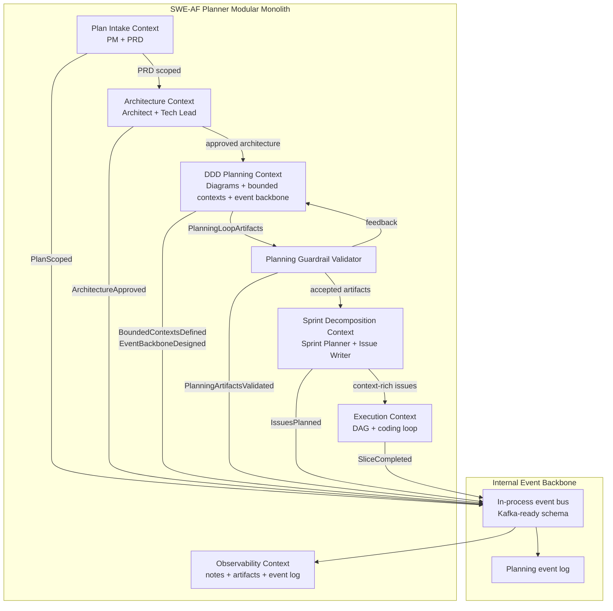

# DDD Modular Planning Loop - TDD Implementation Plan

## Overview

SWE-AF's full planner currently produces a PRD, an architecture document, a Tech
Lead review, sprint issues, execution levels, file conflicts, and issue files. The
architecture step already owns component boundaries and interface precision, but it
does not produce a typed Domain Driven Design planning artifact. It also has no
deterministic loop that verifies the architecture has gone one level deeper into
bounded contexts, aggregates, services, domain events, event backbone, read models,
guardrails, observability, and extraction strategy before Sprint Planner decomposes
the work.

This plan adds an Architect-owned DDD modular planning loop between Tech Lead
architecture approval and Sprint Planner decomposition:

1. Architect produces current/future Mermaid diagrams.
2. Architect defines bounded contexts.
3. For each bounded context, Architect defines aggregates, domain services, and
   domain events.
4. Architect designs a Modular Monolith plus Internal Event Backbone, defaulting to
   a simple in-process event bus that can migrate to queue/pub-sub/Kafka later.
5. Architect defines code-level module contracts, internal event schema, data
   ownership, CQRS-lite read models, architectural guardrails, observability
   requirements, and extraction strategy.
6. A deterministic validator checks that required sections exist and cross-reference
   each other.
7. `plan()` retries the planning-loop reasoner with validator feedback before
   calling Sprint Planner.
8. Sprint Planner and Issue Writer consume the typed artifacts so generated issues
   include bounded-context metadata, event/read-model contracts, guardrails,
   instrumentation requirements, and one end-to-end vertical slice.

The implementation is TDD-first. Each behavior below starts with failing tests,
then minimal code, then refactoring once tests are green.

## Current State Analysis

### Key Discoveries

- `plan()` orchestrates Product Manager, optional Environment Scout, Architect,
  Tech Lead review, Sprint Planner, level computation, issue writing, and
  `PlanResult` creation in `swe_af/app.py:1547`.
- The best insertion point is after Tech Lead approval and before Sprint Planner at
  `swe_af/app.py:1657`, because that preserves the existing execution handoff.
- Planning schemas live in `swe_af/reasoners/schemas.py:10`. `Architecture` is
  generic today, and no schema names bounded contexts, aggregates, domain events,
  event backbone, CQRS-lite read models, data ownership, guardrails, or extraction
  strategy.
- Planning reasoners live in `swe_af/reasoners/pipeline.py`. The existing pattern is
  prompt module + Pydantic schema + `router.harness(..., schema=...)` + `app.call()`.
- Existing prompt tests use signature assertions and literal prompt-content checks in
  `tests/test_multi_repo_prompts.py`.
- Existing planner tests call `plan._original_func` with `mock_agent_ai.side_effect`
  in exact sub-call order in `tests/test_planner_pipeline.py`.
- Existing plan-to-execute contract tests live in
  `tests/test_mock_fixture_cross_feature_integration.py`.
- `Makefile` defines `make test` as `python -m pytest tests/ -x -q` and `make check`
  adds `python -m compileall -q swe_af/`.
- The fast planner is separate and explicitly tested to avoid importing the full
  planner roles. This enhancement should not touch `swe_af/fast/*`.

## Current Software Diagram

The current full planner is a staged pipeline with one Architect/Tech Lead review
loop and a separate execution DAG.

```mermaid
flowchart LR
    Goal[User goal] --> PM[Product Manager]
    PM --> PRD[PRD]
    PRD --> Scout{HAX enabled?}
    Scout -->|yes| EnvScout[Environment Scout]
    Scout -->|no| Architect[Architect]
    EnvScout --> Architect
    Architect --> ArchDoc[Architecture]
    ArchDoc --> TechLead[Tech Lead Review]
    TechLead -->|reject + feedback| Architect
    TechLead -->|approve| Sprint[Sprint Planner]
    Sprint --> Issues[PlannedIssue stubs]
    Issues --> Levels[Compute levels and file conflicts]
    Levels --> IssueWriter[Parallel Issue Writers]
    IssueWriter --> IssueFiles[issue-*.md files]
    IssueFiles --> PlanResult[PlanResult]
    PlanResult --> Execute[run_dag execution]

    FastGoal[Fast goal] -. separate .-> FastPlanner[fast_plan_tasks]
    FastPlanner -. no full planner roles .-> FastTasks[FastTask list]
```



## Future Software Diagram

The future planner keeps the modular monolith shape of SWE-AF but adds a typed
Architect-owned DDD planning loop and an internal planning event stream. The initial
event bus is in-process and append-only for observability; the schema is explicit so
the implementation can later move to pub-sub, queue, or Kafka without changing
domain event contracts.



## Future Bounded Contexts for the Planner

The new planning loop should make these contexts explicit in the generated
architecture artifacts:

| Bounded Context | Aggregate Root | Domain Services | Domain Events |
| --- | --- | --- | --- |
| Plan Intake | `PlanRequest` | `PRDScopingService`, `ContextScoutService` | `PlanRequested`, `PRDValidated`, `ScopedCredentialsNegotiated` |
| Architecture | `ArchitectureSpec` | `ArchitectureDesignService`, `TechLeadReviewService` | `ArchitectureDrafted`, `ArchitectureRejected`, `ArchitectureApproved` |
| DDD Planning | `PlanningLoopArtifacts` | `DomainModelingService`, `PlanningArtifactValidator` | `CurrentDiagramCreated`, `FutureDiagramCreated`, `BoundedContextsDefined`, `PlanningArtifactsValidated` |
| Sprint Decomposition | `IssuePlan` | `IssueDecompositionService`, `IssueRenderingService` | `IssuesPlanned`, `IssueFilesRendered`, `VerticalSliceSelected` |
| Execution | `ExecutionDAG` | `DAGExecutorService`, `CodingLoopService`, `ReplanService` | `IssueStarted`, `IssueCompleted`, `IssueFailed`, `ReplanApplied` |
| Observability | `PlanningEventLog` | `PlanningEventPublisher`, `ArtifactRecorder` | `PlanningEventRecorded`, `GuardrailViolationRecorded`, `SliceTelemetryRecorded` |

## Desired End State

### Public Behavior

When a user runs the full planner:

- The planner returns the same core `PlanResult` fields as today.
- `PlanResult` additionally contains `planning_artifacts`.
- `planning_artifacts` contains current and future Mermaid diagrams.
- `planning_artifacts` contains bounded contexts, and every bounded context has at
  least one aggregate, one domain service, and one domain event.
- `planning_artifacts` contains a modular monolith plan with internal event backbone
  details.
- `planning_artifacts` contains code-level module contracts.
- `planning_artifacts` contains a versioned internal event schema.
- `planning_artifacts` contains data ownership rules.
- `planning_artifacts` contains event bus implementation guidance defaulting to an
  in-process hand-rolled bus with Kafka/pub-sub/queue migration notes.
- `planning_artifacts` contains CQRS-lite read model definitions.
- `planning_artifacts` contains architectural guardrails and observability
  requirements.
- `planning_artifacts` contains an extraction strategy after one vertical slice is
  tested and functional.
- Sprint Planner receives these artifacts and emits at least one issue marked as the
  vertical slice.
- Issue Writer renders bounded-context, event, read-model, guardrail, and
  observability context into issue files.

### Observable Behaviors

1. Given legacy plan data, when `PlanResult` is constructed, then existing execution
   fields still validate.
2. Given complete DDD planning artifacts, when Pydantic models validate them, then
   typed model dumps preserve every section.
3. Given incomplete DDD planning artifacts, when the deterministic validator runs,
   then it returns actionable missing-section feedback.
4. Given a mocked planner run, when the first DDD artifact result is invalid, then
   `plan()` retries the planning-loop reasoner with validator feedback.
5. Given accepted DDD planning artifacts, when Sprint Planner is called, then it
   receives `planning_artifacts`.
6. Given Sprint Planner returns issue metadata, when `PlanResult` is dumped, then
   issue bounded context, contract refs, event refs, read models, guardrails, and
   vertical-slice role are preserved.
7. Given Issue Writer receives an enriched issue, when the prompt is built, then the
   generated task includes the context needed by coder/reviewer agents.
8. Given execution receives a new `PlanResult`, when `_init_dag_state()` runs, then
   planning context is retained for replanning and observability.
9. Given docs are generated, when docs tests run, then current/future diagrams and
   the DDD planning loop are documented.

## What We're NOT Doing

- Not implementing Kafka, a production queue, or a distributed event platform inside
  SWE-AF.
- Not changing the fast planner.
- Not enforcing target-repository import rules with a static analyzer in this slice.
  The initial guardrails are structured planning output plus prompt propagation.
- Not adding live LLM integration tests.
- Not implementing a full event-sourced runtime. The first event backbone is an
  in-process planning event publisher/log designed to preserve event contracts.
- Not changing the external AgentField API contract beyond additive optional fields.

## Testing Strategy

- **Framework**: pytest + pytest-asyncio.
- **Unit tests**: schema construction, deterministic validator, prompt signature and
  content checks.
- **Integration tests**: mocked `plan()` call order and retry behavior, plan-to-DAG
  handoff, issue rendering prompt propagation.
- **Docs tests**: read `docs/ARCHITECTURE.md` and `README.md` and assert required
  sections/terms exist.
- **Mocking**: use `mock_agent_ai` from `tests/conftest.py`; bypass AgentField
  wrappers with `plan._original_func` as existing planner tests do.
- **Commands**:
  - `AGENTFIELD_SERVER=http://localhost:9999 python -m pytest tests/test_planning_artifacts_schema.py -q`
  - `AGENTFIELD_SERVER=http://localhost:9999 python -m pytest tests/test_planning_artifact_prompts.py -q`
  - `AGENTFIELD_SERVER=http://localhost:9999 python -m pytest tests/test_architecture_planning_loop_reasoner.py -q`
  - `AGENTFIELD_SERVER=http://localhost:9999 python -m pytest tests/test_planner_pipeline.py tests/test_mock_fixture_cross_feature_integration.py -q`
  - `AGENTFIELD_SERVER=http://localhost:9999 python -m pytest tests/test_replanner_planning_artifact_context.py -q`
  - `AGENTFIELD_SERVER=http://localhost:9999 python -m pytest tests/test_planning_artifacts_docs.py -q`
  - `AGENTFIELD_SERVER=http://localhost:9999 python -m pytest tests/ -x -q`
  - `make check`

## Behavior 1: Planning Artifact Schemas Are Typed and Backward Compatible

### Test Specification

**Given**: Existing `Architecture`, `PlannedIssue`, and `PlanResult` inputs without
DDD fields.
**When**: The models are constructed and dumped.
**Then**: They remain valid and include safe defaults for new optional fields.

**Given**: A complete DDD modular planning artifact.
**When**: The model is constructed and dumped.
**Then**: Diagrams, bounded contexts, aggregates, services, events, event schema,
data ownership, read models, guardrails, observability, vertical slice, and
extraction strategy are preserved.

### Red: Write Failing Tests

**File**: `tests/test_planning_artifacts_schema.py`

```python
from swe_af.reasoners.schemas import (
    ArchitecturePlanningArtifacts,
    BoundedContextSpec,
    PlanResult,
    PlannedIssue,
)


def test_plan_result_defaults_without_planning_artifacts():
    result = PlanResult(
        prd={"validated_description": "T", "acceptance_criteria": [], "must_have": [], "nice_to_have": [], "out_of_scope": []},
        architecture={"summary": "A", "components": [], "interfaces": [], "decisions": [], "file_changes_overview": ""},
        review={"approved": True, "feedback": "", "summary": "ok"},
        issues=[],
        levels=[],
        artifacts_dir="/tmp",
        rationale="r",
    )
    assert result.planning_artifacts is None


def test_complete_planning_artifacts_round_trip():
    artifacts = ArchitecturePlanningArtifacts(...)
    dumped = artifacts.model_dump()
    assert dumped["current_diagram"]["mermaid"].startswith("flowchart")
    assert dumped["bounded_contexts"][0]["aggregates"][0]["name"] == "PlanRequest"
    assert dumped["event_backbone"]["default_transport"] == "in_process"
```

### Green: Minimal Implementation

**File**: `swe_af/reasoners/schemas.py`

Add Pydantic models with default factories:

- `ArchitectureDiagram`
- `AggregateSpec`
- `DomainServiceSpec`
- `DomainEventSpec`
- `BoundedContextSpec`
- `ModuleContractSpec`
- `InternalEventField`
- `InternalEventSchemaSpec`
- `DataOwnershipRule`
- `EventBusPlan`
- `EventBackbonePlan`
- `ReadModelSpec`
- `ArchitecturalGuardrail`
- `ObservabilityRequirement`
- `VerticalSlicePlan`
- `ExtractionStrategy`
- `ArchitecturePlanningArtifacts`

Extend:

- `Architecture.planning_artifacts: ArchitecturePlanningArtifacts | None = None`
- `PlannedIssue.bounded_context: str = ""`
- `PlannedIssue.contract_refs: list[str] = Field(default_factory=list)`
- `PlannedIssue.domain_events: list[str] = Field(default_factory=list)`
- `PlannedIssue.read_models: list[str] = Field(default_factory=list)`
- `PlannedIssue.guardrails: list[str] = Field(default_factory=list)`
- `PlannedIssue.observability: list[str] = Field(default_factory=list)`
- `PlannedIssue.slice_role: str = ""`
- `PlanResult.planning_artifacts: ArchitecturePlanningArtifacts | None = None`

### Refactor

- Replace new mutable list defaults with `Field(default_factory=list)`.
- Leave existing list defaults untouched unless refactoring all schema defaults in a
  separate, behavior-preserving cleanup pass.
- Keep schema names domain-specific but implementation-neutral.

### Success Criteria

**Automated:**

- Red fails before schema additions:
  `AGENTFIELD_SERVER=http://localhost:9999 python -m pytest tests/test_planning_artifacts_schema.py -q`
- Green passes after schema additions.
- Existing schema tests still pass:
  `AGENTFIELD_SERVER=http://localhost:9999 python -m pytest tests/test_planned_issue_target_repo.py -q`

**Manual:**

- Schema names are understandable to Architect, Sprint Planner, Issue Writer, and
  downstream coders.

## Behavior 2: Deterministic Planning Artifact Validator Enforces the Loop Guardrails

### Test Specification

**Given**: A complete `ArchitecturePlanningArtifacts`.
**When**: The validator runs.
**Then**: It returns no errors.

**Given**: Missing diagrams, contexts without events, missing internal event schema,
missing read models, or missing observability.
**When**: The validator runs.
**Then**: It returns actionable errors suitable for retry feedback.

### Red: Write Failing Tests

**File**: `tests/test_planning_artifact_validator.py`

```python
from swe_af.reasoners.pipeline import validate_planning_artifacts


def test_validator_accepts_complete_artifacts(complete_artifacts):
    assert validate_planning_artifacts(complete_artifacts) == []


def test_validator_rejects_context_without_domain_events(complete_artifacts):
    complete_artifacts.bounded_contexts[0].domain_events = []
    errors = validate_planning_artifacts(complete_artifacts)
    assert any("domain event" in error.lower() for error in errors)
```

### Green: Minimal Implementation

**File**: `swe_af/reasoners/pipeline.py`

Add pure helper:

```python
def validate_planning_artifacts(artifacts: ArchitecturePlanningArtifacts | dict) -> list[str]:
    ...
```

Required checks:

- current diagram exists and contains Mermaid source.
- future diagram exists and contains Mermaid source.
- at least one bounded context.
- every bounded context has aggregates, services, and domain events.
- event backbone default transport is `in_process` unless a more complex transport
  is justified.
- internal event schema has event name, versioning rule, metadata fields, and payload
  fields.
- every domain event has a producer context.
- data ownership rules exist and every bounded context owns or reads data explicitly.
- read models exist and reference source events.
- guardrails exist and include an enforcement mechanism.
- observability requirements exist.
- vertical slice references a bounded context and at least one domain event.
- extraction strategy exists and is gated on a tested functional slice.

### Refactor

- Keep the validator pure and separately testable.
- Return strings instead of raising so `plan()` can pass feedback into a retry.
- Do not call LLMs from validation.

### Success Criteria

**Automated:**

- `AGENTFIELD_SERVER=http://localhost:9999 python -m pytest tests/test_planning_artifact_validator.py -q`

**Manual:**

- Validator errors are specific enough for the Architect prompt to repair them.

## Behavior 3: Architect-Owned Planning Loop Reasoner Produces DDD Artifacts

### Test Specification

**Given**: PRD and approved architecture inputs.
**When**: `run_architecture_planning_loop()` is invoked with a mocked harness result.
**Then**: It calls the harness with `schema=ArchitecturePlanningArtifacts`, writes
the artifact markdown, emits start/complete notes, and returns a model dump.

### Red: Write Failing Tests

**File**: `tests/test_architecture_planning_loop_reasoner.py`

```python
@pytest.mark.asyncio
async def test_architecture_planning_loop_uses_schema_and_writes_artifact(tmp_path):
    with patch("swe_af.reasoners.pipeline.router.harness", new=AsyncMock(return_value=response)):
        result = await run_architecture_planning_loop(...)
    assert result["event_backbone"]["default_transport"] == "in_process"
    assert (tmp_path / ".artifacts" / "plan" / "architecture-planning.md").exists()
```

### Green: Minimal Implementation

**Files**:

- `swe_af/prompts/architecture_planning_loop.py`
- `swe_af/reasoners/pipeline.py`

Add prompt builder:

```python
def architecture_planning_loop_task_prompt(
    *,
    prd: PRD,
    architecture: Architecture,
    repo_path: str,
    architecture_path: str,
    planning_artifacts_path: str,
    validation_feedback: list[str] | None = None,
    workspace_manifest: WorkspaceManifest | None = None,
) -> str:
    ...
```

Prompt requirements:

- produce current software diagram.
- produce future software diagram.
- define bounded contexts.
- define aggregates, services, and domain events per bounded context.
- design modular monolith plus internal event backbone.
- default event bus to simple in-process hand-roll with migration notes for Kafka,
  pub-sub, or queue.
- define code-level module contracts.
- define internal event schema.
- define data ownership.
- define CQRS-lite read models.
- define guardrails.
- prioritize instrumentation and observability.
- define one vertical slice.
- define extraction strategy after a tested functional slice.

Add reasoner:

```python
@router.reasoner()
async def run_architecture_planning_loop(..., validation_feedback: list[str] | None = None) -> dict:
    ...
```

### Refactor

- Keep rendering to markdown small: use a helper `render_planning_artifacts_markdown`.
- Keep prompt construction in the prompt module, not inline in the reasoner.

### Success Criteria

**Automated:**

- `AGENTFIELD_SERVER=http://localhost:9999 python -m pytest tests/test_architecture_planning_loop_reasoner.py -q`

**Manual:**

- The artifact file is readable as an architecture appendix.

## Behavior 4: `plan()` Retries the Planning Loop Before Sprint Planner

### Test Specification

**Given**: PM, Architect, and Tech Lead succeed.
**When**: Planning artifacts pass validation on the first attempt.
**Then**: `plan()` calls Sprint Planner with `planning_artifacts`.

**Given**: The first planning-loop result fails deterministic validation.
**When**: `max_planning_loop_iterations` allows a retry.
**Then**: `plan()` calls `run_architecture_planning_loop` again with feedback before
Sprint Planner runs.

### Red: Write Failing Tests

**File**: `tests/test_planner_pipeline.py`

Add tests beside the existing happy path:

```python
@pytest.mark.asyncio
async def test_plan_runs_architecture_planning_loop_before_sprint_planner(mock_agent_ai, tmp_path):
    mock_agent_ai.side_effect = [prd, arch, review, planning_artifacts, sprint, issue_writer]
    result = await _call_plan(str(tmp_path))
    targets = [call.args[0] for call in mock_agent_ai.call_args_list]
    assert targets.index("swe-planner.run_architecture_planning_loop") < targets.index("swe-planner.run_sprint_planner")
    assert "planning_artifacts" in result
```

```python
@pytest.mark.asyncio
async def test_plan_retries_planning_loop_with_validation_feedback(mock_agent_ai, tmp_path):
    mock_agent_ai.side_effect = [prd, arch, review, invalid_artifacts, valid_artifacts, sprint, issue_writer]
    result = await _call_plan(str(tmp_path), max_planning_loop_iterations=2)
    loop_calls = [c for c in mock_agent_ai.call_args_list if "run_architecture_planning_loop" in c.args[0]]
    assert len(loop_calls) == 2
    assert loop_calls[1].kwargs["validation_feedback"]
```

### Green: Minimal Implementation

**File**: `swe_af/app.py`

Add `plan()` parameters:

- `planning_loop_model: str = "sonnet"`
- `max_planning_loop_iterations: int = 2`

Insert after Tech Lead approval and before Sprint Planner:

```python
planning_artifacts = None
validation_feedback = []
for i in range(max_planning_loop_iterations):
    planning_artifacts = _unwrap(await app.call(
        f"{NODE_ID}.run_architecture_planning_loop",
        prd=prd,
        architecture=arch,
        repo_path=repo_path,
        artifacts_dir=artifacts_dir,
        validation_feedback=validation_feedback,
        model=planning_loop_model,
        ...
    ), "run_architecture_planning_loop")
    validation_feedback = validate_planning_artifacts(planning_artifacts)
    if not validation_feedback:
        break
else:
    raise RuntimeError(...)
```

Pass `planning_artifacts` to `run_sprint_planner` and include it in `PlanResult`.

### Refactor

- Extract `_run_architecture_planning_loop_until_valid(...)` if `plan()` gets too
  large.
- Keep error message short and include validator feedback.

### Success Criteria

**Automated:**

- `AGENTFIELD_SERVER=http://localhost:9999 python -m pytest tests/test_planner_pipeline.py -q`

**Manual:**

- `app.note` phase tags show the planning loop start, retry, and complete.

## Behavior 5: Sprint Planner Consumes DDD Artifacts and Produces Context-Rich Issues

### Test Specification

**Given**: `planning_artifacts` with bounded contexts, contracts, read models, and
vertical slice.
**When**: `sprint_planner_task_prompt()` is built.
**Then**: The prompt includes the DDD artifact summary and mandates context-rich
issue fields.

**Given**: Sprint Planner returns enriched issues.
**When**: `PlannedIssue` validates and `PlanResult` dumps.
**Then**: bounded context, contract refs, domain events, read models, guardrails,
observability, and vertical-slice role survive.

### Red: Write Failing Tests

**File**: `tests/test_planning_artifact_prompts.py`

```python
def test_sprint_planner_prompt_accepts_planning_artifacts():
    sig = inspect.signature(sprint_planner_task_prompt)
    assert "planning_artifacts" in sig.parameters


def test_sprint_planner_prompt_requires_vertical_slice_and_context_fields(artifacts):
    prompt = sprint_planner_task_prompt(goal="g", prd={}, architecture={}, planning_artifacts=artifacts)
    assert "bounded_context" in prompt
    assert "contract_refs" in prompt
    assert "slice_role" in prompt
    assert "vertical slice" in prompt.lower()
```

### Green: Minimal Implementation

**Files**:

- `swe_af/prompts/sprint_planner.py`
- `swe_af/reasoners/pipeline.py`
- `swe_af/reasoners/schemas.py`

Changes:

- Add optional `planning_artifacts` parameter to `run_sprint_planner`,
  `sprint_planner_prompts`, and `sprint_planner_task_prompt`.
- Summarize DDD artifacts in the prompt without dumping huge JSON.
- Mandate the enriched optional `PlannedIssue` fields.
- Require at least one issue with `slice_role="vertical-slice"` that proves one
  aggregate/service/event/read-model path end-to-end.
- Require instrumentation/observability tasks early, not as final cleanup.

### Refactor

- Add a helper `planning_artifacts_context_block(...)` in `swe_af/prompts/_utils.py`
  if the prompt block is reused by Sprint Planner and Issue Writer.

### Success Criteria

**Automated:**

- `AGENTFIELD_SERVER=http://localhost:9999 python -m pytest tests/test_planning_artifact_prompts.py -q`
- Existing multi-repo prompt tests still pass:
  `AGENTFIELD_SERVER=http://localhost:9999 python -m pytest tests/test_multi_repo_prompts.py -q`

**Manual:**

- Prompt stays concise and references artifact sections instead of copying large
  documents.

## Behavior 6: Issue Writer Renders DDD Contracts Into Issue Files

### Test Specification

**Given**: A `PlannedIssue` with bounded-context metadata.
**When**: `issue_writer_task_prompt()` is built.
**Then**: The prompt includes sections for bounded context, module contracts, domain
events, read models, guardrails, and observability.

### Red: Write Failing Tests

**File**: `tests/test_planning_artifact_prompts.py`

```python
def test_issue_writer_prompt_renders_planning_context():
    prompt = issue_writer_task_prompt(issue=enriched_issue, ...)
    assert "Bounded Context" in prompt
    assert "Domain Events" in prompt
    assert "Read Models" in prompt
    assert "Observability" in prompt
```

### Green: Minimal Implementation

**File**: `swe_af/prompts/issue_writer.py`

Add prompt sections only when metadata exists:

- Bounded Context
- Code-Level Contracts
- Domain Events
- CQRS-lite Read Models
- Architectural Guardrails
- Observability Requirements
- Vertical Slice Role

### Refactor

- Keep the issue writer output under the existing concise-file constraint where
  possible by linking to architecture/planning artifact sections.

### Success Criteria

**Automated:**

- `AGENTFIELD_SERVER=http://localhost:9999 python -m pytest tests/test_planning_artifact_prompts.py -q`

**Manual:**

- Issue prompts remain task-focused and do not include implementation code.

## Behavior 7: Planning Context Survives Plan-to-Execution Handoff

### Test Specification

**Given**: `PlanResult` contains `planning_artifacts`.
**When**: `_init_dag_state()` initializes execution.
**Then**: DAG state preserves planning context for replanning and observability.

### Red: Write Failing Tests

**File**: `tests/test_replanner_planning_artifact_context.py`

```python
def test_init_dag_state_preserves_planning_artifacts(tmp_path):
    state = _init_dag_state(plan_result_with_artifacts, repo_path=str(tmp_path), config=ExecutionConfig())
    assert state.planning_artifacts["event_backbone"]["default_transport"] == "in_process"
```

### Green: Minimal Implementation

**Files**:

- `swe_af/execution/schemas.py`
- `swe_af/execution/dag_executor.py`
- `swe_af/prompts/replanner.py`

Changes:

- Add `DAGState.planning_artifacts: dict | None = None`.
- Populate it in `_init_dag_state()`.
- Add a short planning-artifacts summary to `replanner_task_prompt()` so recovery
  decisions understand bounded contexts, events, read models, and guardrails.

### Refactor

- Do not dump full artifact JSON into every execution prompt; summarize only names,
  event contracts, vertical slice, and guardrails.

### Success Criteria

**Automated:**

- `AGENTFIELD_SERVER=http://localhost:9999 python -m pytest tests/test_replanner_planning_artifact_context.py -q`
- `AGENTFIELD_SERVER=http://localhost:9999 python -m pytest tests/test_mock_fixture_cross_feature_integration.py -q`

**Manual:**

- Existing execute-only tests that omit `planning_artifacts` still pass.

## Behavior 8: Planning Events and Observability Are Emitted

### Test Specification

**Given**: `plan()` runs with one retry.
**When**: notes are captured.
**Then**: it emits phase tags for planning-loop start, validation failure, retry, and
completion.

**Given**: a planning artifact is accepted.
**When**: it is written to disk.
**Then**: an append-only planning event log records the major events using the
internal event schema.

### Red: Write Failing Tests

**File**: `tests/test_planning_loop_observability.py`

```python
def test_planning_loop_records_events(tmp_path):
    publish_planning_event(...)
    content = (tmp_path / ".artifacts" / "plan" / "planning-events.jsonl").read_text()
    assert "PlanningArtifactsValidated" in content
```

### Green: Minimal Implementation

**Files**:

- `swe_af/reasoners/pipeline.py`
- `swe_af/app.py`

Add a small in-process event helper:

```python
def publish_planning_event(*, artifacts_dir: str, event: PlanningEvent) -> None:
    ...
```

The first implementation writes JSONL under `.artifacts/plan/planning-events.jsonl`.
No external broker is introduced. The event schema is stable and includes:

- `event_name`
- `event_version`
- `occurred_at`
- `source_context`
- `correlation_id`
- `payload`

### Refactor

- Keep the helper independent of AgentField so tests can run without a server.
- If event publishing grows, move it to `swe_af/planning/events.py`.

### Success Criteria

**Automated:**

- `AGENTFIELD_SERVER=http://localhost:9999 python -m pytest tests/test_planning_loop_observability.py -q`

**Manual:**

- Event log is easy to inspect after a failed planner run.

## Behavior 9: Documentation Captures Current and Future Architecture

### Test Specification

**Given**: Documentation has been updated.
**When**: docs tests run.
**Then**: `docs/ARCHITECTURE.md` and `README.md` describe the DDD planning loop,
current/future diagrams, modular monolith event backbone, CQRS-lite read models,
guardrails, observability priority, vertical slice, and extraction strategy.

### Red: Write Failing Tests

**File**: `tests/test_planning_artifacts_docs.py`

```python
def test_architecture_docs_describe_ddd_planning_loop():
    content = ARCHITECTURE_DOC.read_text()
    assert "DDD Planning Loop" in content
    assert "Modular Monolith" in content
    assert "Internal Event Backbone" in content
    assert "CQRS-lite" in content
```

### Green: Minimal Implementation

**Files**:

- `docs/ARCHITECTURE.md`
- `README.md`

Add:

- current planner diagram.
- future DDD modular planner diagram.
- schema summary.
- planning-loop order.
- event backbone default and migration note.
- code-level bounded context contract explanation.
- internal event schema.
- data ownership and read-model rules.
- observability first-class requirement.
- extraction strategy.

### Refactor

- Keep README concise and link to `docs/ARCHITECTURE.md` for deep detail.

### Success Criteria

**Automated:**

- `AGENTFIELD_SERVER=http://localhost:9999 python -m pytest tests/test_planning_artifacts_docs.py -q`

**Manual:**

- A future implementer can understand why this is a planning artifact enhancement,
  not a runtime Kafka implementation.

## Integration and Full Verification

After all behavior-level tests are green:

```bash
AGENTFIELD_SERVER=http://localhost:9999 python -m pytest \
  tests/test_planning_artifacts_schema.py \
  tests/test_planning_artifact_validator.py \
  tests/test_planning_artifact_prompts.py \
  tests/test_architecture_planning_loop_reasoner.py \
  tests/test_planner_pipeline.py \
  tests/test_mock_fixture_cross_feature_integration.py \
  tests/test_replanner_planning_artifact_context.py \
  tests/test_planning_loop_observability.py \
  tests/test_planning_artifacts_docs.py \
  -q
```

Then:

```bash
AGENTFIELD_SERVER=http://localhost:9999 python -m pytest tests/ -x -q
make check
```

## Implementation Order

1. Schema foundation and backward-compatibility tests.
2. Deterministic planning-artifact validator.
3. Architect planning-loop prompt and reasoner.
4. `plan()` orchestration and retry behavior.
5. Sprint Planner prompt/schema threading.
6. Issue Writer prompt rendering.
7. Execution/replanner context preservation.
8. Planning events and observability.
9. Documentation and diagrams.
10. Full suite verification.

## References

- Research:
  `thoughts/searchable/shared/research/2026-06-23-06-45-architect-planning-agent-contracts.md`
- Main planner:
  `swe_af/app.py:1547`
- Planning reasoners:
  `swe_af/reasoners/pipeline.py:158`
- Planning schemas:
  `swe_af/reasoners/schemas.py:10`
- Architect prompt:
  `swe_af/prompts/architect.py:9`
- Sprint Planner prompt:
  `swe_af/prompts/sprint_planner.py:9`
- Issue Writer prompt:
  `swe_af/prompts/issue_writer.py:8`
- Existing planner tests:
  `tests/test_planner_pipeline.py`
- Existing plan-to-execute contract tests:
  `tests/test_mock_fixture_cross_feature_integration.py`
- Existing prompt tests:
  `tests/test_multi_repo_prompts.py`
